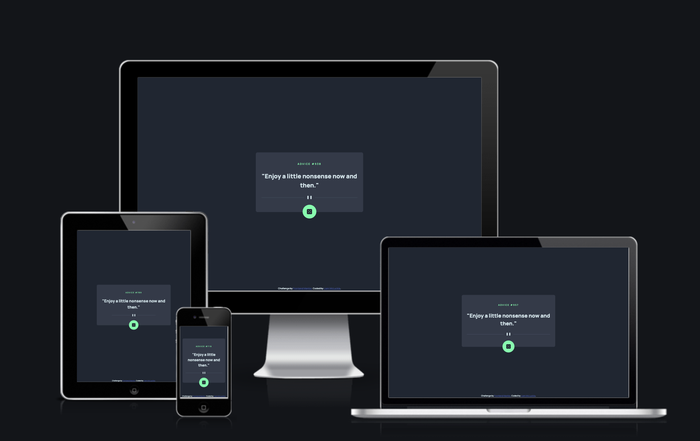
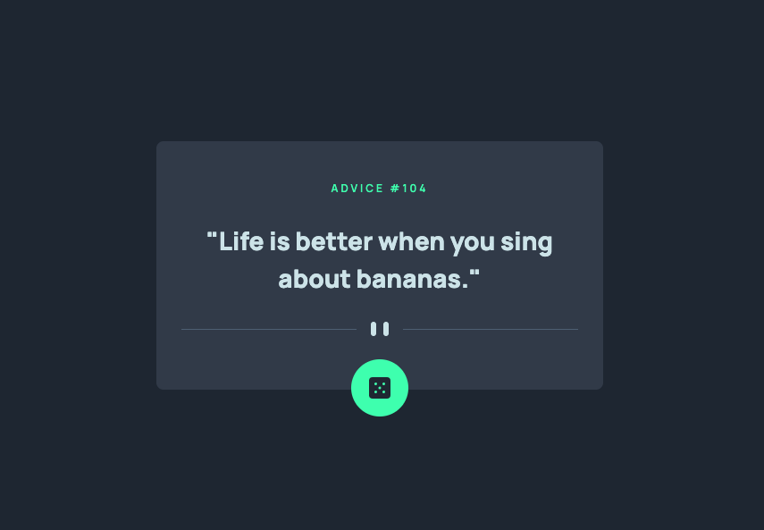
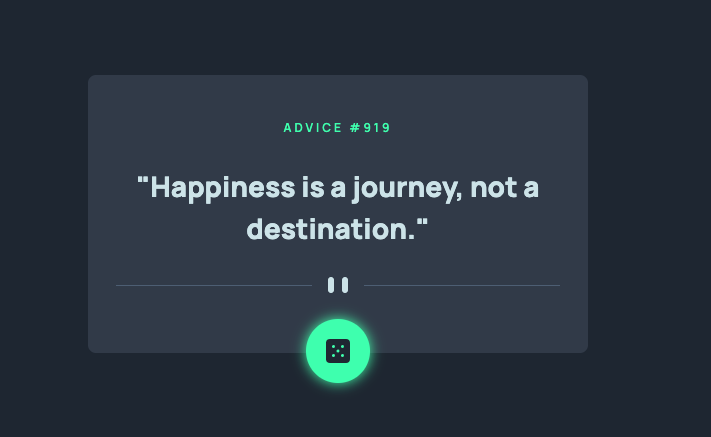

# Frontend Mentor - Advice generator app solution

This is my solution to the [Advice generator app challenge on Frontend Mentor](https://liammcluckie.github.io/advice-generator-app/). Frontend Mentor challenges help you improve your coding skills by building realistic projects.



## Table of contents

-   [Overview](#overview)
    -   [The challenge](#the-challenge)
    -   [Screenshot](#screenshot)
    -   [Links](#links)
-   [My process](#my-process)
    -   [Built with](#built-with)
    -   [What I learned](#what-i-learned)
    -   [Useful resources](#useful-resources)
-   [Author](#author)

## Overview

### The challenge

Users should be able to:

-   Be presented with a piece of advice provided by the API when loading the page.

-   Click the dice button to generate new advice.

-   Use this app on all broswer and device types.

-   Accessible to users with screen readers.

### Screenshot

**Completed Challenge Desktop**



**Hover State Desktop**



### Links

-   Solution URL: [Add solution URL here](https://github.com/liammcluckie/advice-generator-app)
-   Live Site URL: [Add live site URL here](https://liammcluckie.github.io/advice-generator-app/)

## My process

### Built with

-   Semantic HTML5 markup
-   Sass
-   Flexbox
-   Javascript
-   Mobile-first workflow

### What I learned

During this challenge I wanted to use and gain better understanding of CSS the `clamp()` function in order to reduce the amount of media queries needed for larger projects.

I also gained further knowledge on using Javascripts `fetch()` function to get and return JSON data from the API.

```css
blockquote {
    font-size: clamp(1.5rem, 3.5vw, 1.75rem);
}
```

### Useful resources

-   [API Functionality](https://www.ostoncodecypher.com/details?id=158&title=display_random_advice_on_your__website_or__web_app_using_advice_slip_json_api) - This helped me to retrieve the API data. The function was customised for this challenge by adding transitions when the data is being retrieved.

-   [MDN Clamp](https://developer.mozilla.org/en-US/docs/Web/CSS/clamp) - Documentation on using CSS `clamp()` function.

## Author

-   Frontend Mentor - [@liammcluckie](https://www.frontendmentor.io/profile/liammcluckie)
